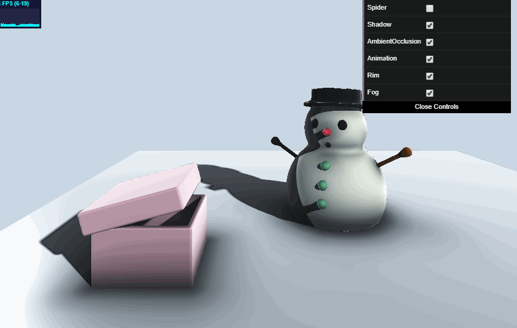

# Implicit-Surface Project: What's in the Box !!!!?

**University of Pennsylvania, CIS 566**

* Jiawei Wang
* Pennkey: jiaww
* Tested on: Windows 10, i7-6700 @ 2.60GHz 16.0GB, GTX 970M 3072MB (Personal)


## Overview
- The project is based on **Ray-marching** and **SDF**, all of the shading process happens in fragment shader. The content of the project is a snowman, scared by something in the box, you can set the checkbox to put there a spider or just make it more mysterious, nothing. For the shading part, there are soft shadow, ambient occlusion, fog, rim highlight and basic blinn-phong, most of them I learned from [Iq's website](http://www.iquilezles.org/www/index.htm) and the [example](https://www.shadertoy.com/view/XlfGzH) on shadertoy.
- [Live Demo]()

|**Final View(Without Spider)**|
|---|
||

## Detail Implementation
* Most of the implementations are pretty simple to understand, so here I just have a brief introduction.
* **Animation**: Basically, the animation is just to change the size and position of the different components of the scene according to the time.
* **Shading detail**: Most of the shading detail, I follow the [Iq's website](http://www.iquilezles.org/www/index.htm) and the [example](https://www.shadertoy.com/view/XlfGzH) on shadertoy.
    * **Soft Shadow**: shoot a ray from hit point to the light direction, to find out if there is an intersection using ray marching again.
    ```glsl
    float softshadow( in vec3 ro, in vec3 rd, float mint, float maxt, float k ){
        float res = 1.0;
        for( float t=mint; t < maxt; )
        {
            float h = f(ro + rd*t).x;
            if( h<0.001 )
                return 0.25;
            res = min( res, k*h/t );
            t += h;
        }
        return res;
    }
    ```
    * **Ambient Occlusion**: From the hit point along his normal direction, keep checking its SDF(map) value, if it keep increasing rapidly, it means there is no occlusion near it. (It is not the precise value of the occlusion, but it can estimate the value approximatly)
    ```glsl
    float ao(vec3 v, vec3 n) {
        const int ao_iterations = 10;
        const float ao_step = 0.15;
        const float ao_scale = 0.75;

        float sum = 0.0;
        float att = 1.0;
        float len = ao_step;

        for (int i = 0; i < ao_iterations; i++)
        {
            sum += (len - f(v + n * len).x) * att;		
            len += ao_step;		
            att *= 0.5;
        }

        return 1.0 - max(sum * ao_scale, 0.0);
    }
    ```
     * **Rim Highlight**: Highlight the pixel if it is more perpendicular to the view ray direction.
     ```glsl
        light += (1.0 - t / 50.0) * vec3(fao * pow(1.0 - abs(dot(normal, q)), 4.0));
    ```


## Resources
- [IQ Starter Pack](http://www.iquilezles.org/www/index.htm)
- [The evolution of motion](https://www.shadertoy.com/view/XlfGzH)
